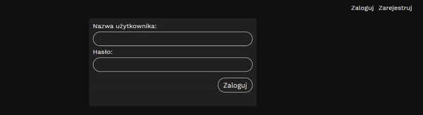
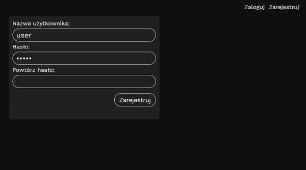
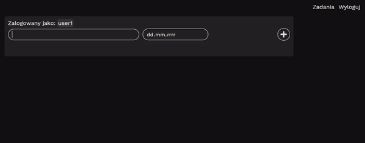
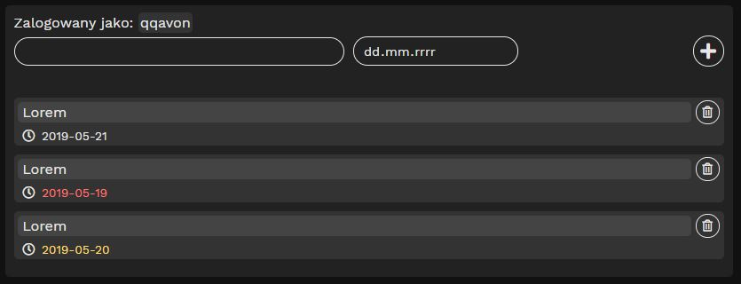

# Registro entradas y salidas :pencil:

## requisitos:
- nodejs
- git
- mongodb
### pasos:
1. descargar git y node
2. clonar este repositorio con el siguiente comando: git clone hhtp://github.com/Rebjai/Audinf
3. hacer "nmp install" en las carpetas frontend y backend

A simple application written in Vue using the backend written in Nodejs.

## Features
- Registration and login.
- Adding and deleting tasks.
- Optional task deadline.

## Technologies

- Vue (CLI 3)
- Axios
- NodeJs
- ExpressJs
- MongoDB
- Mongoose

## Use

### Login

Login is possible after successful registration of the account.
### Registration

Validation is on the **client** and **server** side.
After successful registration, a message will be displayed.
Passwords are hashed.

### Adding and deleting tasks

After logging in, the user can add tasks with an optional deadline.
The date has three colors
- White (More than one day left)
- Red (Is after deadline)
- Yellow (The deadline is today)

